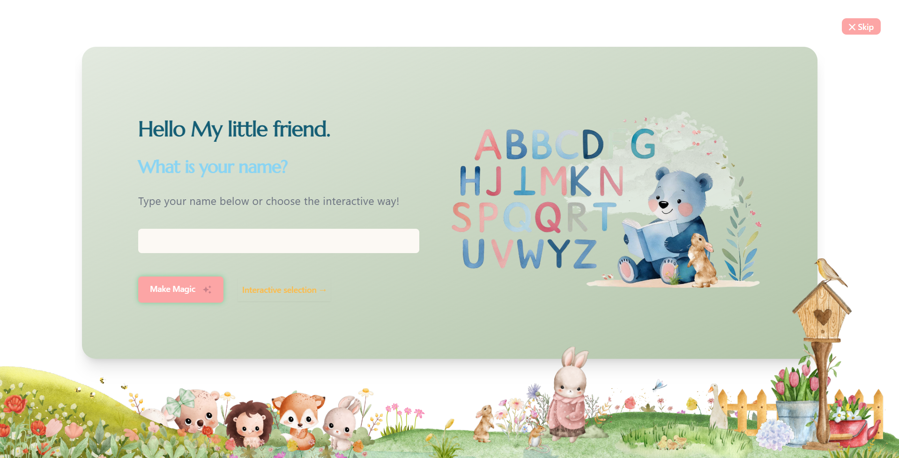

# 📚 Kids English Learning Web App

An interactive educational web application designed for children aged 4–5 years old to play, learn, and explore English words in a fun and engaging way.
Built with React, Node.js, and TailwindCSS, the app features beautiful pastel-colored watercolor illustrations, kid-friendly animations, and pronunciation support to make learning enjoyable.

## 🔥 Live Demo

[View Live Website]()

---



## ✨ Features

**🎴 Pexeso (Memory Game)**

Match lovely illustrated cards.
Hear the correct English pronunciation when a pair is matched.
Tracks moves and matches to encourage progress.

**🗣 English Pronunciation Cards**
Listen the word and pick the correct answer from cards with lovely pictures.
Helps kids build vocabulary and listening skills.

---

**🎨 Upcoming Games (Work in Progress)**

**🧩 Puzzle Game** (drag & drop pieces to complete pictures).

**🖌 Coloring Game** (fill watercolor illustrations with pastel colors).

---

**🎨 Pastel UI & Illustrations**
Gentle watercolor illustrations to keep kids engaged.
Calming pastel colors for a friendly, non-overstimulating experience with no adds and distraction.

---

## 🛠 Tech Stack

**Frontend:** React, TailwindCSS, Framer Motion
**Backend:** Node.js
**Audio:** Web Speech API for pronunciation
**Routing:** React Router
**State Management:** React hooks & Context API

---

## 🚀 Getting Started

### 1. Clone the repository

```bash
git clone https://github.com/Mac7cka/educational-games.git
cd educational-games
```

npm install

# or

yarn install

### 2. Start the development server

npm run dev

---

## 🧪 Customization

Update data in data/words.js according to your customization if you want to add new words and also add svg to public/images.

---

## 🧑‍💻 Author

Marcela Huťanová – @Mac7cka

## 📜 License

This project is open-source and available under the MIT License.

---
